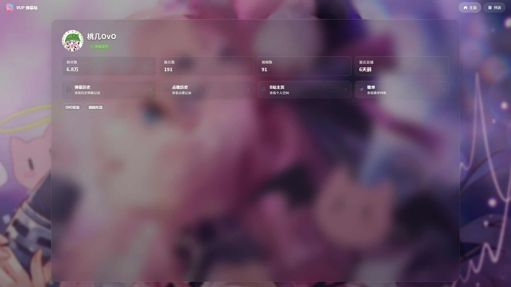
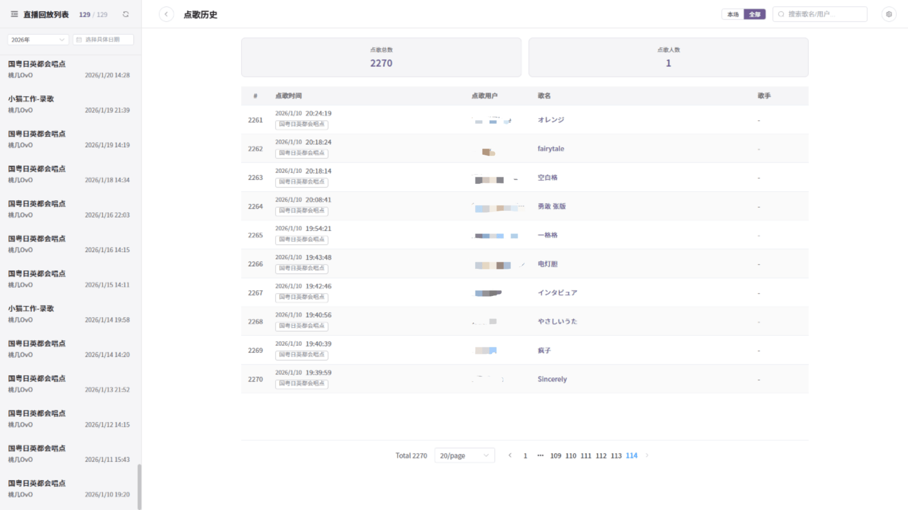

# Danmu Vue Viewer & Recorder

## 1. 项目简介

这是一个用于 Bilibili 直播弹幕录制、回放和统计分析的前后端项目，解决直播弹幕数据采集、历史回看、场次管理和后台维护的问题。

## 2. 功能特性

- 直播弹幕录制与历史回放
- 弹幕统计、营收统计、时间轴分析与关键词分析
- 多主播管理与历史场次筛选
- 点歌记录查询与后台维护
- 主播头像、封面、背景图管理

## 3. 技术栈

- 前端：Vue 3、TypeScript、Vite、Pinia、Element Plus、ECharts
- 后端：.NET 9、ASP.NET Core、EF Core
- 数据库：MySQL
- 其他：Microsoft Garnet、Docker、1Panel、GitHub Actions、腾讯云 COS/CDN

## 4. 快速开始

### 环境要求

- 前端：Node.js 18+、npm 9+
- 后端：.NET SDK 9、MySQL 8+
- 其他：Microsoft Garnet（可选，用于缓存加速）

### 安装与运行

1. 克隆仓库

```bash
git clone https://github.com/sfqy211/danmu_vue
cd danmu_vue
```

2. 安装前端依赖

```bash
npm install
```

3. 在仓库根目录创建 `.env` 文件，可参考：`.env.example` 文件

4. 启动后端

```bash
cd server_net
dotnet run --urls "http://0.0.0.0:3001"
```

5. 回到仓库根目录，启动前端

```bash
npm run dev
```

默认地址：

- 前端：`http://localhost:5200`
- 后端：`http://localhost:3001`

常用命令：

```bash
npm run dev        # 开发前端
npm run dev:all    # 同时开发前后端
npm run build      # 生产构建
npm run start      # 生产启动
```

更多部署与域名接入说明请查看：

- [docs/域名接入与部署指南.md](./docs/域名接入与部署指南.md)

## 5. 项目结构

```text
danmu_vue/
├── docs/          项目说明与部署文档
├── public/        前端静态资源
├── scripts/       构建辅助脚本
├── server/        数据目录与旧代码相关内容
├── server_net/    .NET 后端
├── src/           Vue 前端
├── Dockerfile     Docker 镜像构建文件
└── docker-compose.yml
```

## 6. 截图/演示




## 7. 其他

- 架构与风险说明：[docs/架构基线与风险台账.md](./docs/架构基线与风险台账.md)
- 协作约定：[AGENTS.md](./AGENTS.md)
- 作者：[sfqy211](https://github.com/sfqy211)
- 许可证：[MIT License](./LICENSE)
